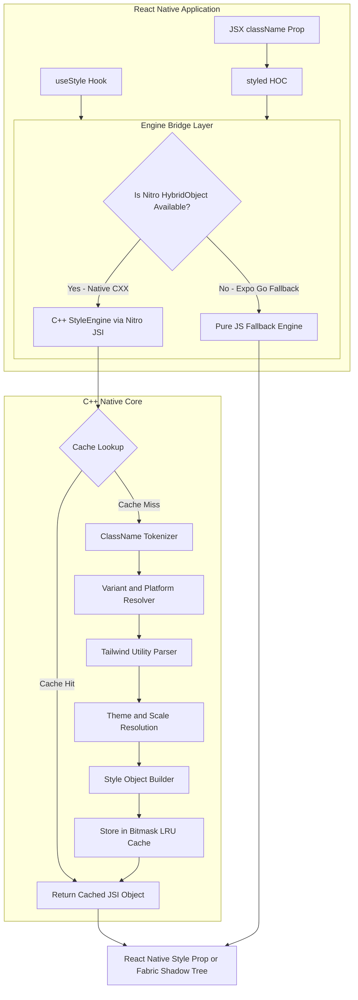
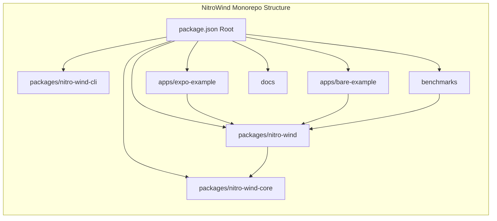

# NitroWind End-to-End Implementation Plan

NitroWind is a high-performance Tailwind CSS engine for React Native with a native C++ core powered by Nitro Modules. It delivers near-zero JavaScript style resolution, deterministic caching with dependency bitmasks, Shadow Tree updates, and a modern developer experience under the MIT license.

## System Architecture and Monorepo Structure

The monorepo structure will be standardized to match the spec:

- [package.json](package.json): Root monorepo configuration with Turborepo, Biome, and Bun workspaces.
- [packages/nitro-wind](packages/nitro-wind): Primary package (renamed from `react-native-nitrowind`), published as `nitro-wind` on npm.
  - `src/`: TypeScript API, `styled()`, `useStyle()`, `NitroWindProvider`, JS fallback engine.
  - `src/specs/styleEngine.nitro.ts`: Nitrogen specification for the C++ HybridObject.
  - `cpp/`: Native C++ engine (`StyleEngine`, `Tokenizer`, `Parser`, `StyleCache`, `ThemeManager`).
  - `nitro.json`: Nitro module configuration for C++ autolinking on iOS and Android.
  - `Nitrowind.podspec` and `android/CMakeLists.txt`: Build integration.
- [packages/nitro-wind-core](packages/nitro-wind-core): Shared pure TypeScript types, theme token defaults, and utility definition tables.
- [packages/nitro-wind-cli](packages/nitro-wind-cli): Optional CLI for pre-generating themes, validating classNames, and configuration.
- [apps/expo-example](apps/expo-example): Expo SDK 57 app verifying the JS fallback engine and Expo compatibility.
- [apps/bare-example](apps/bare-example): React Native 0.86 bare app verifying native C++ compilation, JSI invocation, and Fabric New Architecture integration.
- [benchmarks](benchmarks): Automated performance suite comparing `nitro-wind` against `StyleSheet.create`, `NativeWind`, and `Uniwind`.
- [docs](docs): Documentation site (VitePress) covering installation, utility reference, variants, and migration guides.

## Phased Execution Roadmap

### Phase 0: Project Setup and Package Alignment

- Rename `packages/react-native-nitrowind` to `packages/nitro-wind` and update package metadata to `nitro-wind` with MIT license.
- Update workspace references in [package.json](package.json), [apps/expo-example/package.json](apps/expo-example/package.json), and [apps/bare-example/package.json](apps/bare-example/package.json).
- Scaffold [packages/nitro-wind-core](packages/nitro-wind-core) for pure shared Tailwind utility maps and types.
- Set up automated CI workflows for Biome linting, TypeScript typechecking, and build validation.
- Reserve and prepare npm publishing configuration for `nitro-wind`.

### Phase 1: Core C++ StyleEngine (Nitro HybridObject)

- Define Nitrogen TypeScript interface in [packages/nitro-wind/src/specs/styleEngine.nitro.ts](packages/nitro-wind/src/specs/styleEngine.nitro.ts):
  - `compute(className, theme, platform, context): StyleRecord`
  - `computeBatch(classNames, theme, platform, context): Record<string, StyleRecord>`
  - `setTheme(theme): void`
  - `clearCache(): void`
  - `getCacheSize(): number`
- Configure [packages/nitro-wind/nitro.json](packages/nitro-wind/nitro.json) with `all: { language: "c++", implementationClassName: "HybridStyleEngine" }`.
- Run Nitrogen codegen to generate C++ header specifications and JSI registration hooks.
- Implement C++ modules in `packages/nitro-wind/cpp/`:
  - `Tokenizer`: Fast string view scanning and split on whitespace; extracts prefix variants (`dark:`, `ios:`, `android:`, `hover:`, `active:`).
  - `ThemeManager`: Color palette, typography scale, spacing multiplier, radius scale, and breakpoint mapping.
  - `Parser`: Matches utility tokens to React Native style attributes (flexbox, layout, margins, paddings, colors, borders, opacity, transforms).
  - `ArbitraryValueParser`: Handles bracket syntax `[#ff0055]`, `[28px]`, `[1.5]`.
  - `StyleCache`: LRU cache keyed by 64-bit FNV-1a hash of className plus environment context.
  - Dependency bitmasks: Assign bits for `VARIANT_DARK`, `PLATFORM_IOS`, `PLATFORM_ANDROID`, `VIEWPORT_WIDTH`. Invalidate only relevant cache entries when context shifts.
- Implement minimal compute path: `compute("p-4 bg-red-500")` -> `{ padding: 16, backgroundColor: "#ef4444" }`.

### Phase 2: JavaScript and React Layer

- Implement `StyleEngine` wrapper with automatic Nitro instance initialization in [packages/nitro-wind/src/index.ts](packages/nitro-wind/src/index.ts).
- Build `useStyle(className)` hook:
  - Consumes active theme and platform context.
  - Queries native C++ engine with sub-millisecond JSI dispatch.
- Build `styled(Component)` higher-order function:
  - Intercepts `className` prop, computes style, and merges with incoming `style` prop.
  - Supports `View`, `Text`, `Pressable`, `Image`, `ScrollView`, `TextInput`.
- Create `NitroWindProvider` for runtime theme switching (light, dark, custom) and media query context.
- Create pure TypeScript fallback engine in `packages/nitro-wind/src/fallback/jsEngine.ts` for Expo Go environments lacking custom native builds.

### Phase 3: Advanced Features and Fabric Integration

- Reanimated 4 transition layer: Translate transition utility classes (`transition-all`, `duration-300`, `ease-in-out`) into shared values and animated styles.
- Group and peer variants: Support `group-active:*`, `group-focus:*`, `peer-checked:*` via parent-child context propagation.
- Container queries and post-layout reads for responsive breakpoints based on container dimensions.
- Zero-re-render theme path: Direct C++ Fabric Shadow Tree property propagation where available on React Native New Architecture.
- React Native Web compatibility layer: Map utilities to CSS classes or React Native Web style objects.

### Phase 4: Tooling, DX, and Benchmarks

- Metro / Babel transformer plugin: Optional build-time pre-compilation of static utility strings into pre-computed indices.
- Benchmark suite in `benchmarks/`:
  - Resolution speed for simple vs complex utility strings.
  - Cache hit performance and throughput (million ops/sec).
  - 1,000-row list scrolling render time comparison against `StyleSheet.create`, `NativeWind`, and `Uniwind`.
- Example application updates:
  - Showcase dynamic themes, variants, layout utilities, and animated cards in both Expo and Bare apps.

### Phase 5: Testing, Polish, and Release

- C++ GoogleTest / Catch2 unit tests for tokenizer, parser, cache, and theme resolvers.
- Jest / Vitest unit tests for TypeScript hooks, components, and JS fallback engine.
- End-to-end integration testing on iOS Simulator and Android Emulator via GitHub Actions.
- Comprehensive VitePress documentation site with interactive examples.
- Automated semantic-release and npm publishing under MIT.

