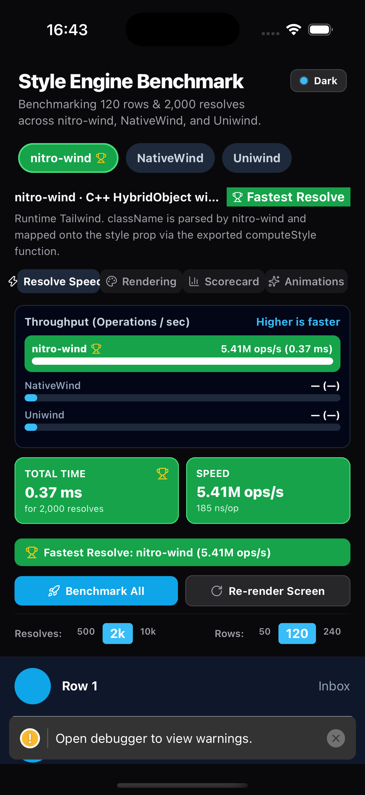
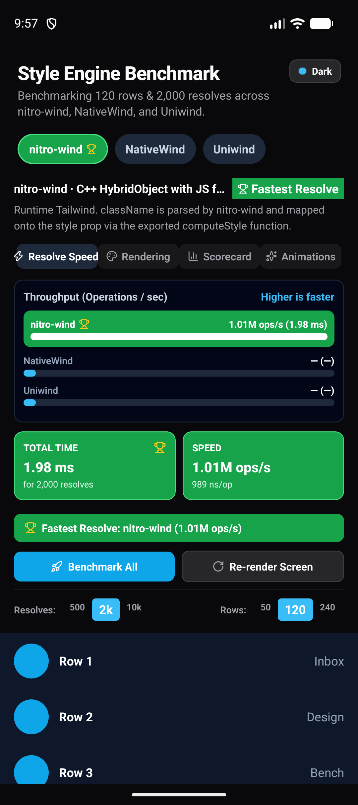

# NitroWind

**High-performance Tailwind CSS engine for React Native, powered by Nitro Modules**

`nitro-wind` brings the familiar Tailwind utility-class API to React Native with a native C++ core. It delivers near-zero JavaScript style resolution, a JS fallback for Expo Go, and excellent performance while keeping Tailwind's developer experience.

**Fully free and open source** under the MIT license.

## Install

```bash
bun add nitro-wind react-native-nitro-modules
```

Add the Babel plugin so `className` works on React Native `View` / `Text` and static class names can be hoisted:

```js
// babel.config.js
module.exports = {
  presets: [
    // Expo: "babel-preset-expo"
    // Bare RN: "module:@react-native/babel-preset"
  ],
  plugins: ["nitro-wind/babel"],
};
```

Then wrap the app in `NitroWindProvider`. Expo Go uses the JavaScript engine automatically. A development build or bare React Native app loads the native C++ engine (and native theme transitions) after you rebuild.

## Expo

Works in **Expo Go** (JS fallback) and in a **dev client / prebuild** (native C++ engine).

```bash
npx create-expo-app@latest MyApp
cd MyApp
npx expo install nitro-wind react-native-nitro-modules
```

```js
// babel.config.js
module.exports = function (api) {
  api.cache(true);
  return {
    presets: ["babel-preset-expo"],
    plugins: ["nitro-wind/babel"],
  };
};
```

```tsx
// App.tsx
import { StatusBar } from "expo-status-bar";
import { NitroWindProvider, styled } from "nitro-wind";
import { Text, View } from "react-native";

const Box = styled(View);

export default function App() {
  return (
    <NitroWindProvider>
      <StatusBar style="auto" />
      <Box className="flex-1 items-center justify-center bg-white dark:bg-zinc-950">
        <Text className="text-xl font-bold text-zinc-900 dark:text-white">
          Hello nitro-wind
        </Text>
      </Box>
    </NitroWindProvider>
  );
}
```

```bash
# Expo Go — JS engine
npx expo start

# Native C++ engine (rebuild after installing nitro-wind)
npx expo run:ios
npx expo run:android
```

`expo run:*` creates a development build. Expo Go cannot load custom native code, so it stays on the JS fallback until you use a dev client.

Repo example: [`apps/expo-example`](apps/expo-example).

## Bare React Native

Nitro autolinks the native module. After installing, rebuild the app — do not use Fast Refresh alone for the first native install.

```bash
npx @react-native-community/cli init MyApp
cd MyApp
bun add nitro-wind react-native-nitro-modules
```

```js
// babel.config.js
module.exports = {
  presets: ["module:@react-native/babel-preset"],
  plugins: ["nitro-wind/babel"],
};
```

```tsx
// App.tsx
import { NitroWindProvider, styled } from "nitro-wind";
import { Text, View } from "react-native";

const Box = styled(View);

export default function App() {
  return (
    <NitroWindProvider>
      <Box className="flex-1 items-center justify-center bg-white dark:bg-zinc-950">
        <Text className="text-xl font-bold text-zinc-900 dark:text-white">
          Hello nitro-wind
        </Text>
      </Box>
    </NitroWindProvider>
  );
}
```

```bash
# iOS
bundle exec pod install --project-directory=ios
bun run ios

# Android
bun run android
```

Repo example: [`apps/bare-example`](apps/bare-example).

## Examples

### `styled()` and `className`

```tsx
import { styled } from "nitro-wind";
import { View, Text } from "react-native";

const Card = styled(View);
const Title = styled(Text);

export function ProfileCard() {
  return (
    <Card className="m-4 rounded-2xl bg-white p-4 dark:bg-zinc-900 ios:shadow-md">
      <Title className="text-lg font-semibold text-zinc-900 dark:text-white">
        nitro-wind
      </Title>
    </Card>
  );
}
```

You can also import pre-styled primitives (`View`, `Text`, `Pressable`, …) from `nitro-wind` instead of wrapping them yourself.

### `useStyle()`

```tsx
import { useStyle } from "nitro-wind";
import { View, Text } from "react-native";

export function Badge() {
  const { style } = useStyle("rounded-full bg-indigo-600 px-3 py-1");
  return (
    <View style={style}>
      <Text className="text-xs font-medium text-white">Native</Text>
    </View>
  );
}
```

### Theme switching

```tsx
import { NitroWind, ThemeTransitionPreset, useNitroWind } from "nitro-wind";
import { Pressable, Text } from "react-native";

export function ThemeToggle() {
  const { theme, setTheme } = useNitroWind();

  return (
    <Pressable
      className="rounded-full bg-zinc-200 px-4 py-2 dark:bg-zinc-800"
      onPress={() =>
        setTheme(theme === "dark" ? "light" : "dark", {
          preset: ThemeTransitionPreset.CircleCenter,
          duration: 400,
        })
      }
    >
      <Text className="text-zinc-900 dark:text-white">Theme: {theme}</Text>
    </Pressable>
  );
}

// Or without the hook:
NitroWind.setTheme("dark", { preset: ThemeTransitionPreset.Fade });
```

On a native iOS or Android build this uses the snapshot overlay (fade, slide, circle, blur). Expo Go falls back to the JS overlay.

## This repository

```
packages/
  nitro-wind/          Main React Native library (C++ Nitro HybridObject + JS API)
  nitro-wind-core/     Shared tokenizer, parser, theme tokens, JS engine
  nitro-wind-cli/      Theme generation and className validation
apps/
  expo-example/        Expo SDK 57 (JS fallback)
  bare-example/        React Native 0.86 (native C++ engine)
  compare-example/     nitro-wind vs NativeWind vs Uniwind
```

```bash
bun install
bun run check
bun test packages/nitro-wind-core packages/nitro-wind

cd apps/expo-example && bun run start
cd apps/bare-example && bun run ios
cd apps/compare-example && bun run start
```

| iPhone 17 Pro | Pixel 10 |
| --- | --- |
|  |  |

Resolve Speed only times a synchronous, headless `className → style` call. `nitro-wind` exposes `computeStyle()`; NativeWind (`cssInterop`) and Uniwind (`useResolveClassNames`) resolve inside a React render, so they show `—` here and are compared on the Rendering tab.

## License

MIT — free for everyone, forever.
